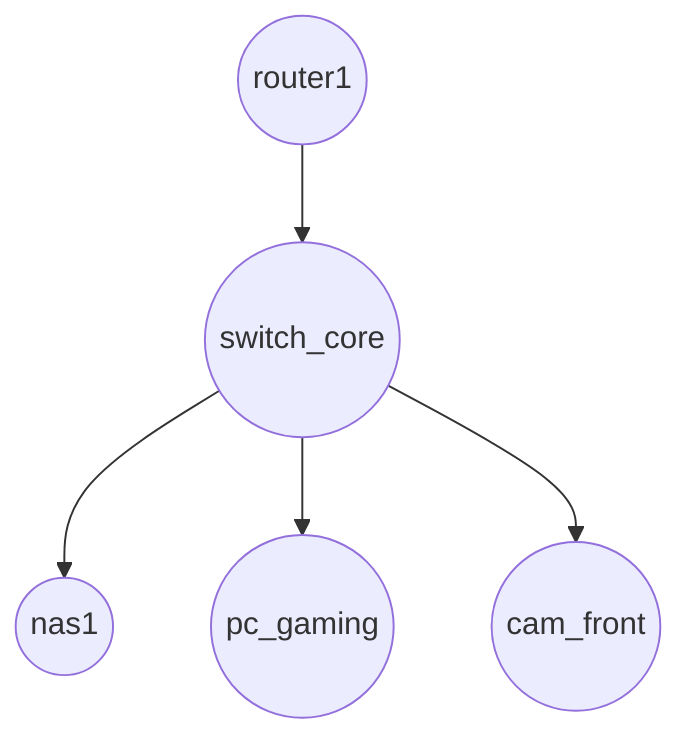

Below is a lightweight **“Tech-Map” recipe** you can follow.
It balances three goals:

1. **Easy to write by hand** (plain Markdown + YAML).
2. **LLM-friendly** (all the facts live in one structured block that any model can parse).
3. **Auto-graphable** (a Mermaid diagram is generated from the same identifiers you put in the YAML).

---

## ① Folder / file layout

```
home-tech-map/
├─ README.md           ← high-level intro & Mermaid diagram
├─ inventory.md        ← the canonical YAML inventory (one block)
└─ history/            ← dated snapshots if you want versioned states
```

> *Tip:* Put the folder in a private Git repo so every hardware change is tracked automatically.

---

## ② Writing the inventory (YAML inside a Markdown code-fence)

1. Make one top-level key, `devices:`.

2. For each device create a short **id** (no spaces) and list:

   * `label` – human-readable name.
   * `type` – `pc | server | camera | router | switch | ups | other`.
   * `roles` – main functions (NAS, Plex, NVR, desktop, etc.).
   * `hw` – key hardware bits (CPU, RAM, disks, NICs).
   * `os_fw` – OS + version or firmware.
   * `ip` – static IP or DHCP reservation.
   * `links` – list of ids this device talks to physically.
   * *(optional)* anything else: location, purchase-date, power-draw…

3. Keep every value on one line if possible; multiline values are OK but avoid tabs.

````markdown

```yaml
devices:
  nas1:
    label: “Proxmox NAS”
    type: server
    roles: [“ZFS storage”, “VM host”]
    hw: “Ryzen 5700G, 64 GB RAM, 5×16 TB HDD, 2×1 TB NVMe, 10 GbE SFP+”
    os_fw: “Proxmox VE 8.2”
    ip: 192.168.10.5
    links: [switch_core]
  switch_core:
    label: “TP-Link TL-SX1008”
    type: switch
    roles: [“10 GbE aggregation”]
    hw: “8-port 10 GbE unmanaged”
    os_fw: “n/a”
    ip: 192.168.10.2
    links: [router1, nas1, pc_gaming, cam_front]
  pc_gaming:
    label: “Main desktop”
    type: pc
    roles: [“Gaming”, “Video edit”]
    hw: “i7-12700K, RTX 4070, 32 GB RAM, 2 TB NVMe”
    os_fw: “Windows 11 Pro 24H2”
    ip: 192.168.10.20
    links: [switch_core]
  cam_front:
    label: “Door Cam”
    type: camera
    roles: [“Front door NVR feed”]
    hw: “Reolink RLC-810A PoE”
    os_fw: “v3.4.0615”
    ip: 192.168.10.101
    links: [switch_core]
  router1:
    label: “OPNsense gateway”
    type: router
    roles: [“Firewall”, “DHCP”, “WireGuard”]
    hw: “Protectli VP2410, 4-core C3558, 8 GB RAM, 2×2.5 GbE”
    os_fw: “OPNsense 24.1”
    ip: 192.168.10.1
    links: [switch_core]
````

````

---

## ③ Auto-drawing the network (Mermaid)

Place this block in `README.md`.  
Because Mermaid is pure text, you can have the LLM *rewrite it* every time you add or rename a device.

```markdown


Rendered, it looks like this:

router1 → switch_core → {nas1, pc_gaming, cam_front}

---

## ④ Workflow for updates & asking an LLM

1. **Edit `inventory.md`** – add, remove or tweak devices.  
2. **Regenerate the Mermaid block** (you can ask ChatGPT: *“Read the YAML and emit the new Mermaid edge list.”*).  
3. **Commit** the change – now you have history.  
4. **Ask for advice**: paste only the YAML block (no Mermaid needed) into an LLM and request e.g.  
   > “Suggest cooling improvements” or “Spot single-points-of-failure”.

---

## ⑤ Why this structure works

| Need | How it’s met |
|------|--------------|
| Human readability | YAML + Markdown render nicely in any text viewer. |
| Machine readability | Indentation + predictable keys → easy JSON parse. |
| Graphing | Mermaid edges are a one-liner per link. |
| Version control | Markdown diff shows exactly what changed. |
| Extensible | Add new fields (e.g. `power_draw`, `warranty_until`) without breaking old scripts. |

---

### Final pointers

* Keep ids lowercase, alphanumeric; change the `label` freely.  
* If you have multiple VLANs or Wi-Fi SSIDs, add `network:` inside each device.  
* For cameras, including the `rtsp:` or `api:` URL can help later automations.  
* Periodically export your switch/router configs and drop them in the repo for full disaster recovery.

Happy mapping — and enjoy the instant LLM feedback loop!
