# TechDome Network Topology

```mermaid
graph TD
    %% Internet and ISP Connection
    Internet([Internet]) --> router_isp{Huawei OptiXstar<br/>EG8145X6-10<br/>Fiber 300Mb}
    
    %% Main Wi-Fi Network
    router_isp --> wifi_casa[Personal-6AF-2.4Ghz<br/>Wi-Fi Network]
    
    %% Core Network Infrastructure
    router_isp --> switch_sg108[TP-Link TL-SG108<br/>8-port GigE<br/>Core Switch]
    router_isp --> switch_sf1005d[TP-Link TL-SF1005D<br/>5-port 100Mb<br/>Low Speed]
    router_isp --> switch_sg105[TP-Link TL-SG105<br/>5-port GigE<br/>TV Cabinet]
    
    %% Living Room Devices
    subgraph living_room [" 🏠 LIVING ROOM "]
        tv_main[Samsung QN55Q65C<br/>55'' 4K QLED TV<br/>ARC Hub]
        nvidia_shield[NVIDIA Shield TV Pro<br/>4K Streaming<br/>Moonlight Client]
        nintendo_switch[Nintendo Switch<br/>Console Gaming]
        echo_dot3[Amazon Echo Dot 3<br/>Alexa Voice<br/>BT Speaker Link]
        speaker_stanmore3[Marshall Stanmore III<br/>Bluetooth Speaker]
    end
    
    %% Office/Desk Devices
    subgraph office [" 💻 OFFICE "]
        gaming_pc[SFF AM5 Desktop<br/>Ryzen 9 7900X3D<br/>RTX 4070 Ti Super<br/>Gaming PC]
        mini_m4[Mac mini M4<br/>32GB RAM<br/>Workstation]
        ada[ADA - Asustor FS6706T<br/>NAS Server<br/>Panchimio/Backup]
        monitors_dual24[2× Samsung F24T35<br/>24'' 75Hz Displays]
        dock_thinkpad[ThinkPad USB-C Dock<br/>Display Hub]
    end
    
    %% Bedroom
    subgraph bedroom [" 🛏️ BEDROOM "]
        tplink_wa850re[TP-Link TL-WA850RE<br/>Wi-Fi Extender<br/>N300 2.4GHz]
    end
    
    %% Outside/Security
    subgraph outside [" 🏡 OUTSIDE "]
        hik_dvr[Hikvision DVR<br/>DS-7208HGHI-M1<br/>8-ch Recorder]
        hik_cam_1[Hikvision Camera 1<br/>Analog]
        hik_cam_2[Hikvision Camera 2<br/>Analog]
        hik_cam_3[Hikvision Camera 3<br/>Analog]
        hik_cam_4[Hikvision Camera 4<br/>Analog]
    end
    
    %% House on the Back
    subgraph house_back [" 🏘️ HOUSE ON THE BACK "]
        atras_ap[Rompemuros AP<br/>2.4GHz Wi-Fi<br/>Access Point]
    end
    
    %% Lab/Spare Room
    subgraph spare_room [" 🔬 LAB "]
        retro_pc[Sandy Bridge Tower<br/>i7-2600<br/>GTX 660 Ti<br/>Retro PC]
    end
    
    %% Network Connections - Core Infrastructure
    switch_sg108 --> gaming_pc
    switch_sg108 --> mini_m4
    switch_sg108 --> ada
    
    %% Living Room Connections
    switch_sf1005d --> tv_main
    switch_sg105 --> nvidia_shield
    tv_main --> nvidia_shield
    tv_main --> nintendo_switch
    wifi_casa -.-> echo_dot3
    
    %% Bedroom Connections
    wifi_casa -.-> tplink_wa850re
    
    %% Office Display Connections
    gaming_pc --> monitors_dual24
    mini_m4 --> monitors_dual24
    gaming_pc --> dock_thinkpad
    mini_m4 --> dock_thinkpad
    
    %% Security System Connections
    switch_sg105 --> hik_dvr
    hik_dvr --> hik_cam_1
    hik_dvr --> hik_cam_2
    hik_dvr --> hik_cam_3
    hik_dvr --> hik_cam_4
    
    %% Remote Access Point
    switch_sg105 --> atras_ap
    
    %% Lab Connection
    switch_sg105 --> retro_pc
    
    %% Smart Home Hub
    switch_sf1005d --> hue_bridge[Philips Hue Bridge<br/>Smart Lighting]
    
    %% Styling
    classDef router fill:#ff6b6b,stroke:#d63031,stroke-width:3px,color:#fff
    classDef switch fill:#74b9ff,stroke:#0984e3,stroke-width:2px,color:#fff
    classDef pc fill:#55a3ff,stroke:#2d3436,stroke-width:2px,color:#fff
    classDef entertainment fill:#fd79a8,stroke:#e84393,stroke-width:2px,color:#fff
    classDef security fill:#fdcb6e,stroke:#e17055,stroke-width:2px,color:#000
    classDef wifi fill:#a29bfe,stroke:#6c5ce7,stroke-width:2px,color:#fff
    classDef storage fill:#00b894,stroke:#00a085,stroke-width:2px,color:#fff
    classDef internet fill:#2d3436,stroke:#636e72,stroke-width:3px,color:#fff
    
    class router_isp router
    class switch_sg108,switch_sf1005d,switch_sg105 switch
    class gaming_pc,mini_m4,retro_pc pc
    class tv_main,nvidia_shield,nintendo_switch,echo_dot3,speaker_stanmore3 entertainment
    class hik_dvr,hik_cam_1,hik_cam_2,hik_cam_3,hik_cam_4 security
    class wifi_casa,tplink_wa850re,atras_ap wifi
    class ada storage
    class Internet internet
```

## Network Overview

### Core Infrastructure
- **Main Router**: Huawei OptiXstar EG8145X6-10 (Fiber 300Mb)
- **Core Switch**: TP-Link TL-SG108 (8-port GigE) - Office backbone
- **Distribution**: Multiple 5-port switches for different areas

### Key Network Segments

#### 🏠 Living Room Entertainment Hub
- Samsung 55" 4K TV as central display with ARC
- NVIDIA Shield Pro for 4K streaming and gaming
- Nintendo Switch for console gaming
- Smart home integration with Echo Dot and Hue Bridge

#### 💻 Office Workstation Network
- High-performance gaming PC (Ryzen 9 7900X3D + RTX 4070 Ti Super)
- Mac mini M4 workstation
- Asustor NAS (ADA) for file serving and backup
- Dual 24" monitors with docking station

#### 🔒 Security System
- 8-channel Hikvision DVR
- 4 analog security cameras
- Dedicated network segment for surveillance

#### 📡 Wireless Coverage
- Main 2.4GHz Wi-Fi from router
- Bedroom Wi-Fi extender for coverage
- Separate access point for house on the back

### Connection Types
- **Solid lines**: Wired Ethernet connections
- **Dashed lines**: Wireless connections
- **Color coding**: Different device types for easy identification
