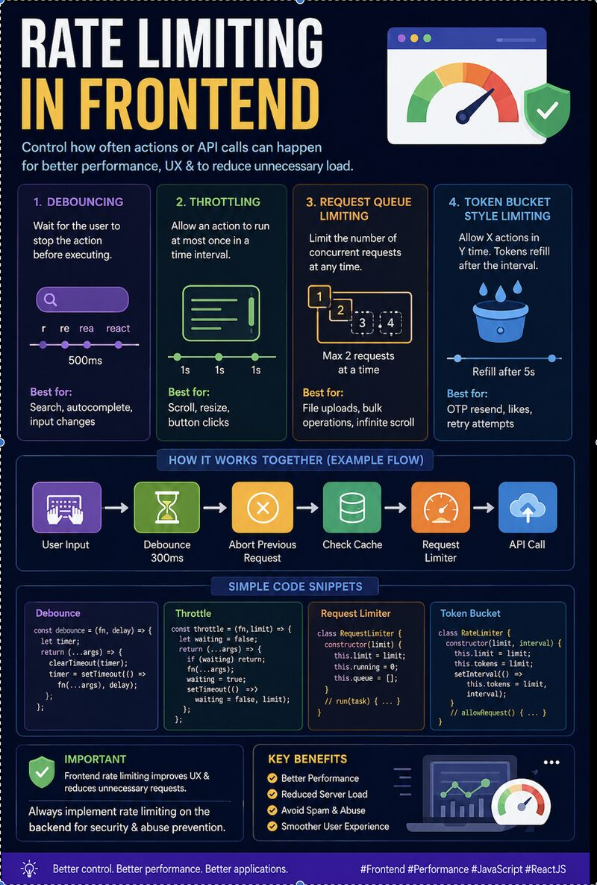

Most frontend developers start by learning components, but scalable frontend systems are built on key principles such as:
- Caching
- Concurrency control
- Request management
- Rate limiting

Frontend rate limiting is essential as it helps to:
- Prevent API spam
- Improve performance
- Reduce unnecessary network calls
- Create a smoother user experience

In modern React and Next.js applications, common techniques include:
- Debouncing
- Throttling
- Request Queue Limiting
- Token Bucket strategy

Real-world applications often combine these techniques. 
Example flow:
User Input → Debounce → Abort Previous Request → Cache → Request Limiter → API Call

This is how production-grade frontend applications optimize performance. 

What other frontend performance techniques do you use in production apps??
Would love to hear your thoughts and learn from others as well.

Sharing a simple visual cheat sheet below.

