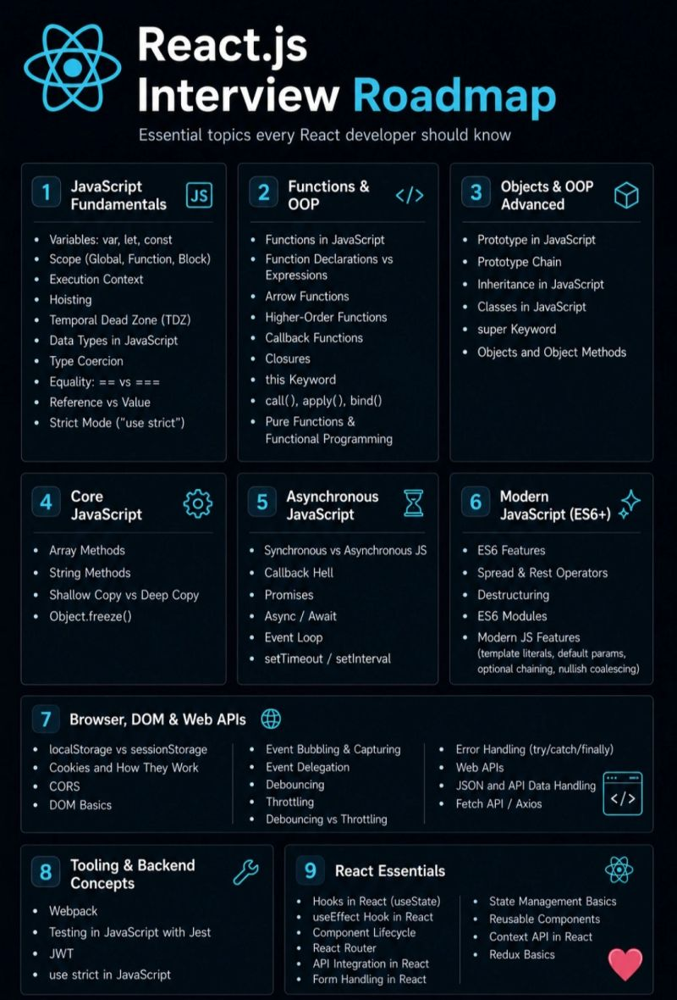

💫This roadmap covers the core areas every React/Frontend developer should know:

🔹 JavaScript Fundamentals
🔹 Functions & OOP
🔹 Async JavaScript
🔹 DOM & Web APIs
🔹 Modern ES6+ Features
🔹 Tooling & Backend Concepts
🔹 React Essentials

The goal was simple: 👉 Make learning paths visually understandable for beginners and interview prep candidates.

Tech learning becomes easier when information is structured properly.
Good UI isn't just for apps — it matters in educational content too.

