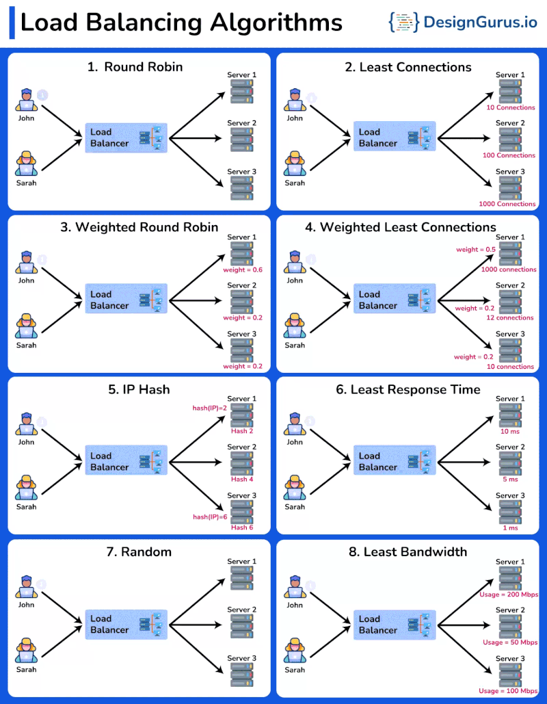

𝟴 𝗹𝗼𝗮𝗱 𝗯𝗮𝗹𝗮𝗻𝗰𝗶𝗻𝗴 𝗮𝗹𝗴𝗼𝗿𝗶𝘁𝗵𝗺𝘀 𝘆𝗼𝘂 𝘀𝗵𝗼𝘂𝗹𝗱 𝗸𝗻𝗼𝘄:

1️⃣ 𝗥𝗼𝘂𝗻𝗱 𝗥𝗼𝗯𝗶𝗻:
It sends each new request to the next server in a rotating order.
↳ Useful when all servers have similar capabilities and you want to spread the load evenly.

2️⃣ 𝗟𝗲𝗮𝘀𝘁 𝗖𝗼𝗻𝗻𝗲𝗰𝘁𝗶𝗼𝗻𝘀:
It directs traffic to the server with the fewest active connections.
↳ Useful when servers have different workloads, balancing them more efficiently.

3️⃣ 𝗪𝗲𝗶𝗴𝗵𝘁𝗲𝗱 𝗥𝗼𝘂𝗻𝗱 𝗥𝗼𝗯𝗶𝗻:
It gives more requests to servers with higher weights or capacities.
↳ Useful when some servers are more powerful and can handle more traffic.

4️⃣ 𝗪𝗲𝗶𝗴𝗵𝘁𝗲𝗱 𝗟𝗲𝗮𝘀𝘁 𝗖𝗼𝗻𝗻𝗲𝗰𝘁𝗶𝗼𝗻𝘀:
It considers both server capacity and current connections to assign requests.
↳ Useful when servers differ in performance, ensuring a fair distribution.

5️⃣ 𝗜𝗣 𝗛𝗮𝘀𝗵:
It uses the client's IP address to decide which server will handle the request.
↳ Useful to keep a client connected to the same server, which is important for session consistency.

6️⃣ 𝗟𝗲𝗮𝘀𝘁 𝗥𝗲𝘀𝗽𝗼𝗻𝘀𝗲 𝗧𝗶𝗺𝗲:
It sends requests to the server with the quickest response and fewest connections.
↳ Useful to reduce delays and improve the user experience.

7️⃣ 𝗥𝗮𝗻𝗱𝗼𝗺:
It picks a server at random for each new request.
↳ Useful when you don't need to consider server load or differences in server capacity.

8️⃣ 𝗟𝗲𝗮𝘀𝘁 𝗕𝗮𝗻𝗱𝘄𝗶𝗱𝘁𝗵:
It directs traffic to the server using the least network bandwidth at the moment.
↳ Useful when managing network usage is important to prevent congestion.

