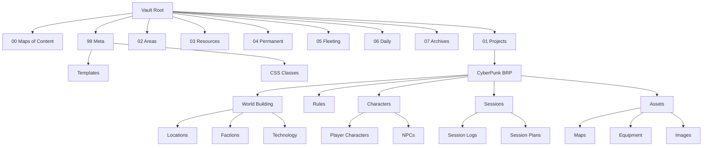

# System Patterns

## Architecture
The vault follows a hierarchical folder structure with clear separation of concerns:

## Key Technical Decisions
1. **Folder Numbering**: Numerical prefixes ensure consistent ordering and clear hierarchy
2. **Template System**: Standardized templates in Meta folder for consistent note creation
3. **CSS Customization**: Dedicated classes for visual styling and organization
4. **Meta Section**: Isolated space for system configuration and maintenance
5. **Archive Strategy**: Dedicated space for older content to maintain active vault performance
6. **TTRPG Organization**:
   - Modular project structure for game components
   - Standardized character sheet templates
   - Session log format for consistent recording
   - Asset management system for game resources
   - Rules reference organization

## Design Patterns
1. **Progressive Organization**:
   - Fleeting → Permanent note progression
   - Daily notes as entry point
   - Project/Area separation for focus

2. **Content Hierarchy**:
   - Maps of Content for navigation
   - Clear categorization system
   - Metadata consistency

3. **Template Usage**:
   - Daily note templates
   - Project templates
   - Consistent formatting

4. **TTRPG Patterns**:
   - Character progression tracking
   - World state management
   - Session preparation workflow
   - Asset organization system
   - Rules reference structure

## Component Relationships
- **Daily Notes** feed into **Fleeting Notes** and **Projects**
- **Fleeting Notes** evolve into **Permanent Notes**
- **Projects** and **Areas** reference **Resources**
- **Maps of Content** link across all categories
- **Meta** section supports all other components
- **Archives** store processed content from all sections

### TTRPG Component Relationships
- **World Building** informs **Session Plans** and **NPCs**
- **Character Sheets** reference **Rules** and **Equipment**
- **Session Logs** update **World State** and **Character Progress**
- **Maps** link to **Locations** and **Session Plans**
- **Factions** interact with **NPCs** and **Technology**
- **Equipment** relates to **Technology** and **Character Sheets**
